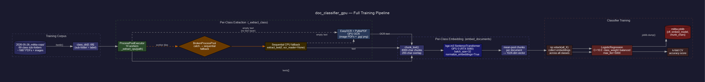
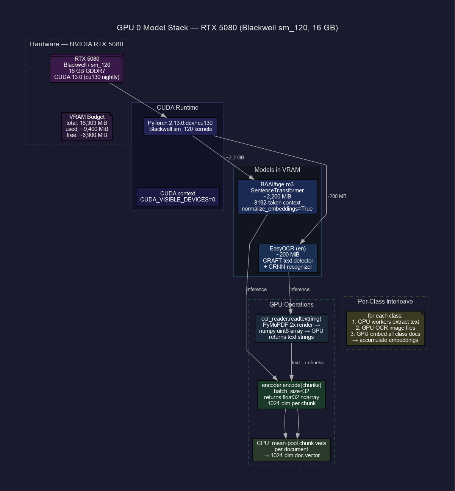
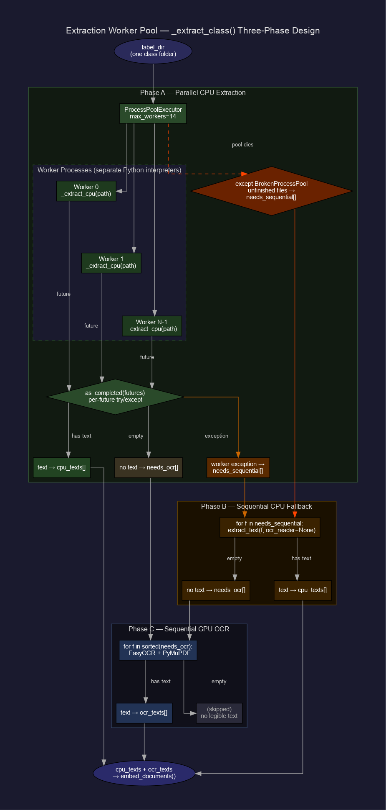
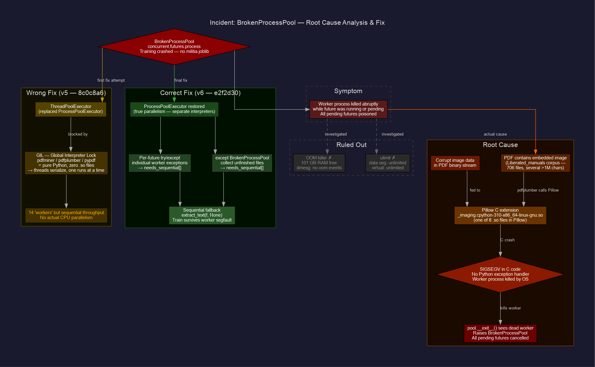
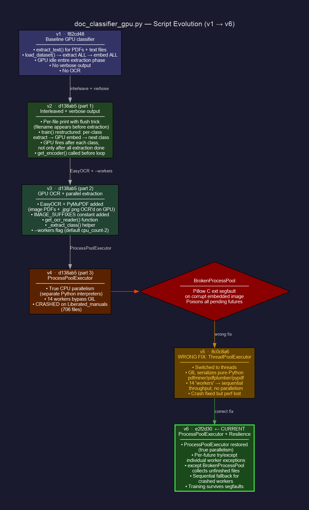

# doc_classifier_gpu — GPU Embedding Document Classifier


[](https://www.python.org/)
[](https://pytorch.org/)
[](https://developer.nvidia.com/cuda-toolkit)
[](https://www.nvidia.com/)
[](https://huggingface.co/BAAI/bge-m3)
[](https://github.com/JaidedAI/EasyOCR)
[](https://ubuntu.com/)

**Session:** 2026-05-30_092836 · **Script:** `doc_classifier_gpu.py`  
Predecessor (TF-IDF baseline): [`../2026-05-30_091736_doc-classifier/`](../2026-05-30_091736_doc-classifier/)

---

## Quick Start

```bash
# 1. Create venv and install Blackwell-compatible PyTorch (cu130 nightly required for sm_120)
python3 -m venv ~/doc-clf-gpu-env
source ~/doc-clf-gpu-env/bin/activate
pip install --pre torch --index-url https://download.pytorch.org/whl/nightly/cu130

# 2. Verify RTX 5080 is visible (must print True (12, 0))
python -c "import torch; print(torch.cuda.is_available(), torch.cuda.get_device_capability(0))"

# 3. Install remaining deps
pip install sentence-transformers easyocr pymupdf scikit-learn joblib pdfplumber python-docx striprtf

# 4. Train (sub-folders of training_root become class labels)
CUDA_VISIBLE_DEVICES=0 python doc_classifier_gpu.py train /path/to/training_root -m model.joblib

# 5. Classify
CUDA_VISIBLE_DEVICES=0 python doc_classifier_gpu.py predict /path/to/new_doc.pdf -m model.joblib
```

---

## Overview

This is the semantic upgrade to the TF-IDF baseline. Instead of word-frequency vectors,
each document is embedded by a transformer encoder that understands meaning — so two
documents using completely different vocabulary but describing the same concept land
close together in vector space.

**Use this when:**
- Categories share overlapping vocabulary (e.g. all folders have military jargon but differ by topic/role)
- The TF-IDF baseline plateaus at accuracy you don't trust
- You have an idle RTX 5080 with ~16 GB of free VRAM

**Stick with the TF-IDF baseline when:**
- Categories differ purely by vocabulary (legal vs. financial vs. personal) — TF-IDF will
  match or beat this script and runs in seconds with no model download
- You need a quick sanity-check run with no GPU dependencies

### Pipeline architecture



*Full data flow: militia-copy corpus → parallel CPU extraction → GPU OCR → chunk → bge-m3 embed → mean-pool → LogisticRegression → model bundle*

---

## Blackwell PyTorch install

The RTX 5080 is Blackwell (compute capability **sm_120**). Stock PyTorch wheels top out at
sm_90 — running them will either crash with `no kernel image available` or silently fall
back to CPU. The cu130 nightly wheel ships the required sm_120 kernels.

```bash
pip install --pre torch --index-url https://download.pytorch.org/whl/nightly/cu130

# Must print: True (12, 0)
python -c "import torch; print(torch.cuda.is_available(), torch.cuda.get_device_capability(0))"
```

Verified working: `torch 2.13.0.dev20260521+cu130` on driver 580 / CUDA 13.0.

---

## GPU stack

Both models are loaded onto GPU 0 at startup and remain resident for the duration of training.



| Model | VRAM | Purpose |
|-------|------|---------|
| `BAAI/bge-m3` | ~2,200 MiB | Document embedding — 8192-token context, 1024-dim output |
| EasyOCR (en) | ~200 MiB | OCR for scanned PDFs and image files |
| **Total in use** | **~9,400 MiB** | of 16,303 MiB available on RTX 5080 |

First run downloads bge-m3 (~2.2 GB) to `~/.cache/huggingface/` and EasyOCR weights
(~100 MB) to `~/.EasyOCR/`. Both are cached; subsequent runs load from disk.

---

## GPU pinning

Worlock has two GPUs:
- **GPU 0 — RTX 5080 (16 GB, Blackwell)** — use this one
- **GPU 1 — RTX 3080 (10 GB)** — display attached, ~557 MiB in use by compositor

Always set `CUDA_VISIBLE_DEVICES=0` so training doesn't compete with the desktop for VRAM.

---

## Parallel CPU extraction

Text extraction is parallelized across CPU cores using `ProcessPoolExecutor`. On worlock
(16 physical cores / 32 threads) the default is 14 workers, giving ~14× faster extraction
for CPU-readable files compared to sequential processing.



**Three-phase extraction per class:**

1. **Phase A — Parallel CPU** (`ProcessPoolExecutor`, 14 workers): each worker calls
   `extract_text()` with no OCR. pdfminer C extensions (via Pillow, when PDFs contain
   embedded images) run in separate interpreter processes, bypassing the GIL.

2. **Phase B — Sequential CPU fallback**: if a worker crashes (e.g. Pillow segfault on a
   corrupt image), a `BrokenProcessPool` guard catches it and retries those files
   sequentially. The training run continues rather than crashing.

3. **Phase C — Sequential GPU OCR**: files that returned no text (scanned PDFs, `.jpg`,
   `.png`, etc.) are OCR'd via EasyOCR + PyMuPDF on GPU 0.

> **Note on ThreadPoolExecutor:** an earlier version used `ThreadPoolExecutor` to avoid
> the `BrokenProcessPool` crash. This was incorrect — `pdfminer`, `pdfplumber`, and
> `pypdf` are pure Python with no `.so` files; the GIL serializes threads and eliminates
> any parallelism. `ProcessPoolExecutor` with exception resilience is the correct approach.
> See [incident notes](#incident-notes) and `diagrams/incident1_brokenpoolprocess_fault_tree`.

---

## Usage

```bash
# Train — sub-folders of training_root become the class labels
CUDA_VISIBLE_DEVICES=0 python doc_classifier_gpu.py train \
  /path/to/training_root -m militia.joblib

# Classify a single file
CUDA_VISIBLE_DEVICES=0 python doc_classifier_gpu.py predict \
  /path/to/new_doc.pdf -m militia.joblib

# Classify every file in a folder
CUDA_VISIBLE_DEVICES=0 python doc_classifier_gpu.py predict \
  /path/to/unlabelled_folder/ -m militia.joblib
```

Output: top three candidate classes with confidence percentages per file.

```
fieldmanual_007.pdf                      -> strategy 88%, C2 7%, Spec_ops 5%
patrol_photo.jpg                         -> camps 61%, Forest_hiking 24%, geography 15%
unknown_scan.pdf                         -> <no extractable text>
```

Wide margin → high confidence. Tight spread → document is ambiguous between categories,
or those categories need more training examples.

---

## Key flags

| Flag | Default | Notes |
|------|---------|-------|
| `--embed-model` | `BAAI/bge-m3` | 8192-token context. Lighter: `BAAI/bge-small-en-v1.5` (fast), `all-MiniLM-L6-v2` (tiny) |
| `--chunk-chars` | `4000` | Characters per chunk before mean-pooling. Lower for short docs |
| `--workers` | `cpu_count-2` (max 16) | Parallel CPU extraction processes. Tune down if memory-constrained |
| `-m` / `--model` | `model.joblib` | Output path for trained model bundle |

`--embed-model` and `--chunk-chars` are **train-time parameters** baked into the saved
bundle — you don't pass them at predict time, they're loaded automatically.

---

## How chunking works

Long documents (PDFs especially) exceed any encoder's context window. The script splits
each document into overlapping 4000-character chunks with a 200-character overlap, embeds
each chunk independently via bge-m3, then **mean-pools** them into a single document vector.

This matters for long documents: a 40-page field manual has important content on page 1
and page 38. A naive truncation approach would drop page 38 entirely. Mean-pooling preserves
signal from the full document at the cost of slightly blurring page-level detail. The 200-char
overlap prevents sentences split at a chunk boundary from losing context in both halves.

---

## Supported formats

| Format | Extraction method |
|--------|-------------------|
| `.pdf` with text layer | PyMuPDF/fitz (CPU) — handles embedded images safely via MuPDF |
| `.pdf` scanned / image-only | PyMuPDF render → EasyOCR (GPU) |
| `.jpg` `.jpeg` `.png` `.webp` `.tiff` `.bmp` | EasyOCR direct (GPU) |
| `.txt` `.md` `.rst` `.csv` `.log` `.json` `.xml` `.html` `.eml` | `read_text()` (CPU) |
| `.docx` | python-docx (CPU) |
| `.rtf` | striprtf (CPU) |
| `.doc` (old binary format) | ❌ needs `antiword` or `textract` |

Files that yield no text after all extraction attempts are printed as `(skipped)` and
excluded from training. Check stderr for worker-level error details.

---

## Model bundle format

The saved `.joblib` file is a plain dict — not a sklearn Pipeline:

```python
{
    "clf": LogisticRegression(...),   # trained classifier
    "embed_model": "BAAI/bge-m3",    # encoder name — reloaded from cache at predict time
    "chunk_chars": 4000,             # chunking param
}
```

Portability: moving the bundle to another machine requires either internet access on first
`predict` (to download the embedding model), or copying `~/.cache/huggingface/` and
`~/.EasyOCR/` alongside it.

---

## Interpreting CV accuracy

Cross-validated accuracy is computed on held-out folds and reflects real generalisation,
not memorisation. Roughly:

- **< 15 docs/class** → CV score is noise; add more examples before trusting the number
- **15–50 docs/class** → meaningful signal; score guides whether to continue or escalate
- **50+ docs/class** → reliable; if accuracy is still mediocre, consider encoder fine-tuning

The script adapts fold count to `min(5, smallest_class_size)` and skips CV entirely if
any class has fewer than 2 documents.

---

## When to escalate to fine-tuning

Embedding + LR is the right tool up to roughly **50 documents per class**. Above that,
with still-mediocre accuracy, fine-tuning the encoder end-to-end pulls ahead — the RTX
5080's 16 GB handles a base-size encoder (ModernBERT-base, ~150M params) comfortably.

Upgrade path:
1. Replace `get_encoder()` with a `transformers` AutoModel + AutoTokenizer
2. Add a training loop (HuggingFace Trainer or plain PyTorch)
3. Keep the same `extract_text()`, `chunk_text()`, and `embed_documents()` logic

---

## Incident notes

> **BrokenProcessPool crash — 2026-05-30**
>
> Training on the Liberated_manuals class (706 files) crashed with
> `concurrent.futures.process.BrokenProcessPool`. Root cause: Pillow's C extension
> (`_imaging.so`) segfaulted on a corrupt embedded image inside a PDF, killing the worker
> process and poisoning all pending futures. This was **not OOM** — 101 GB RAM was free.
>
> Fixed by adding a two-level exception guard: per-future `try/except` for individual
> worker failures, plus an outer `except BrokenProcessPool` that collects unfinished files
> and retries them sequentially. The training run now survives a worker segfault.



---

## Script evolution



| Version | Commit | Key change |
|---------|--------|------------|
| v1 | `f82cd48` | Baseline: extract all → embed all. GPU idle during extraction. |
| v2 | `d138ab5` | Interleaved per-class extract→embed. Per-file verbose output. |
| v3 | `d138ab5` | EasyOCR + PyMuPDF GPU OCR. `--workers` flag. `_extract_class()`. |
| v4 | `d138ab5` | `ProcessPoolExecutor` — true CPU parallelism. **Crashed.** |
| v5 | `8c0c8a6` | `ThreadPoolExecutor` — wrong fix, GIL serializes pure-Python pdfminer. |
| v6 | `e2f2d30` | `ProcessPoolExecutor` restored + `BrokenProcessPool` resilience. Insufficient for Liberated_manuals (98% image PDFs). |
| v7 | `7c4380d` | `rich` TUI: Progress bars, GPU stat lines, Panel headers, summary Table. |
| v8 | `b0ea134` | **Current.** pdfplumber → PyMuPDF (fitz). `ProcessPoolExecutor` → `Pool(maxtasksperchild=1)`. Eliminates Pillow segfaults. |

---

## File tree

```
2026-05-30_092836_doc-classifier-gpu/
├── doc_classifier_gpu.py       # main script (v6)
├── README.md                   # this file
├── SESSION.md                  # session log, incidents, resume command
└── diagrams/
    ├── arch1_training_pipeline.(dot|png|svg)
    ├── arch2_extraction_worker_pool.(dot|png|svg)
    ├── arch3_gpu_model_stack.(dot|png|svg)
    ├── evol1_script_versions.(dot|png|svg)
    └── incident1_brokenpoolprocess_fault_tree.(dot|png|svg)
```

Related session: [`../2026-05-30_091736_doc-classifier/`](../2026-05-30_091736_doc-classifier/) — TF-IDF baseline
