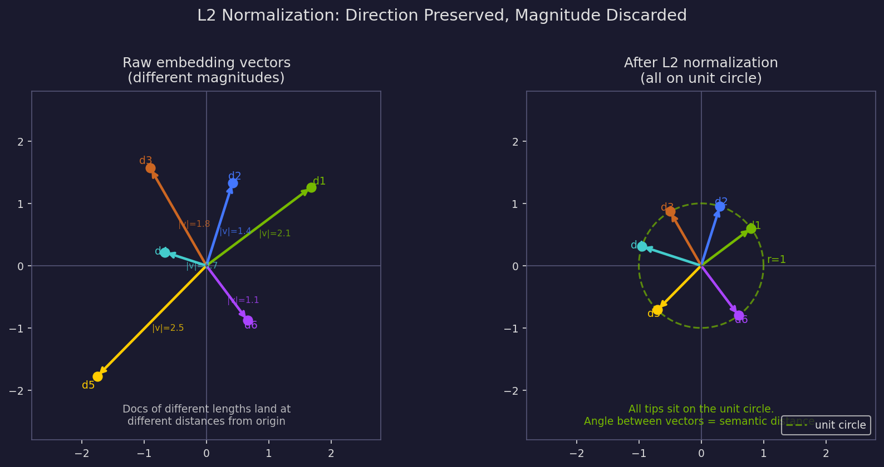
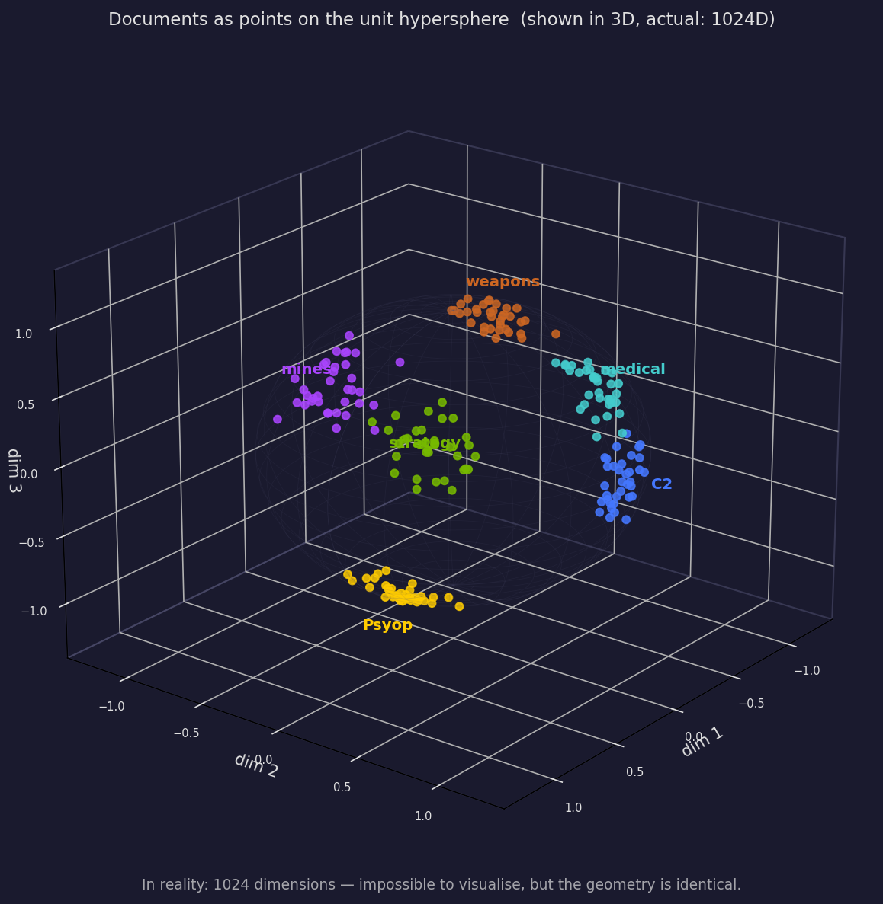
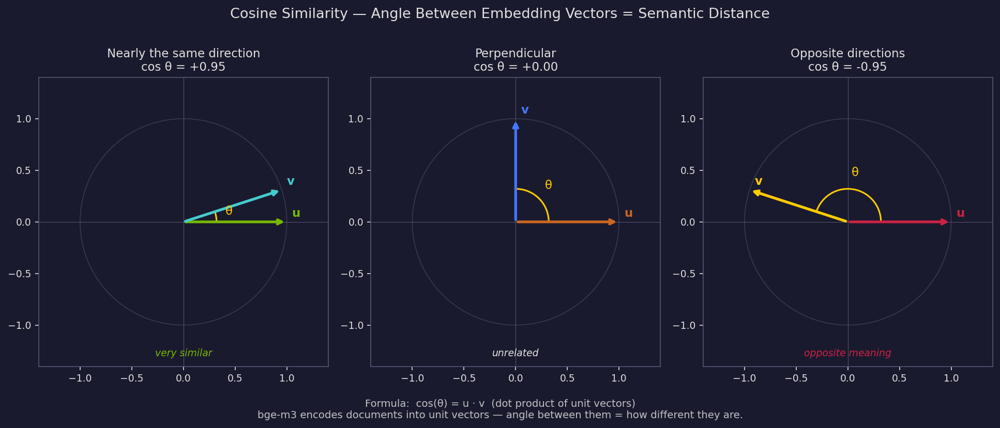
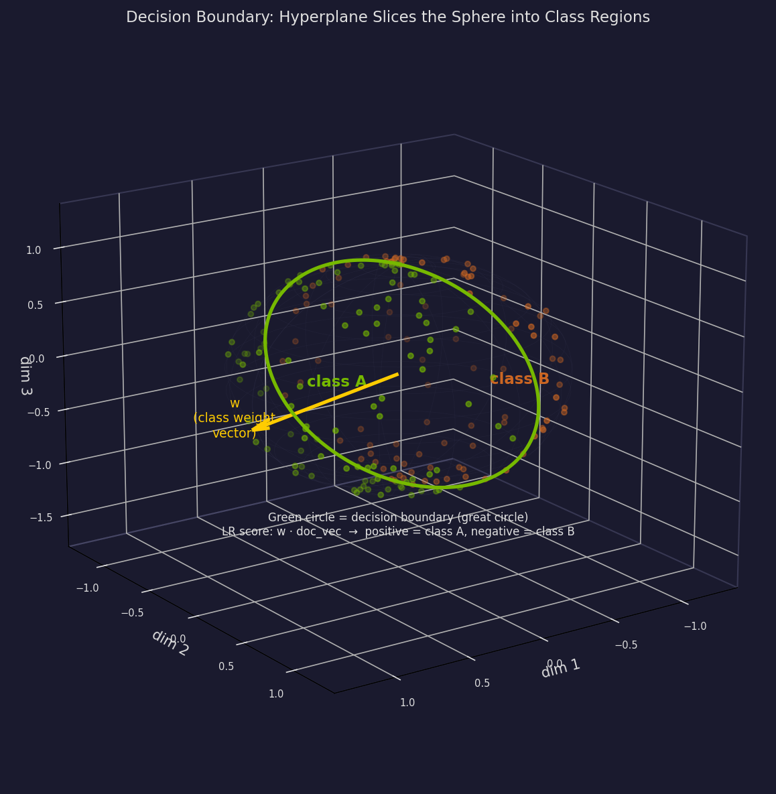
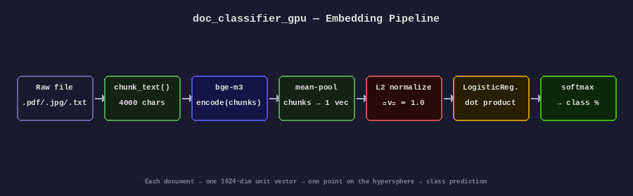
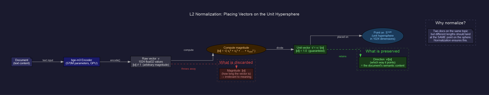
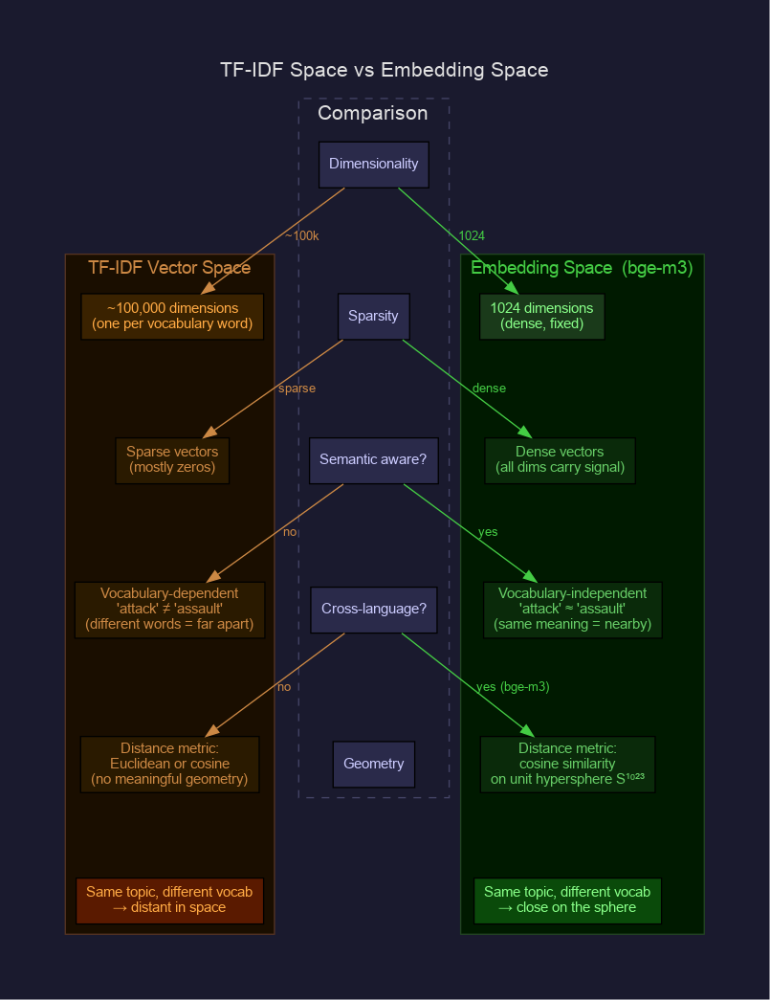
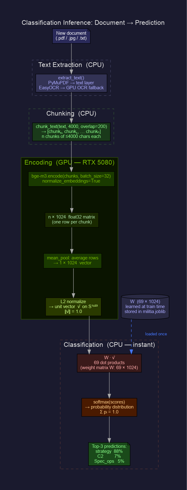
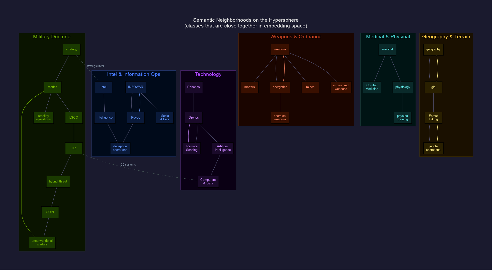
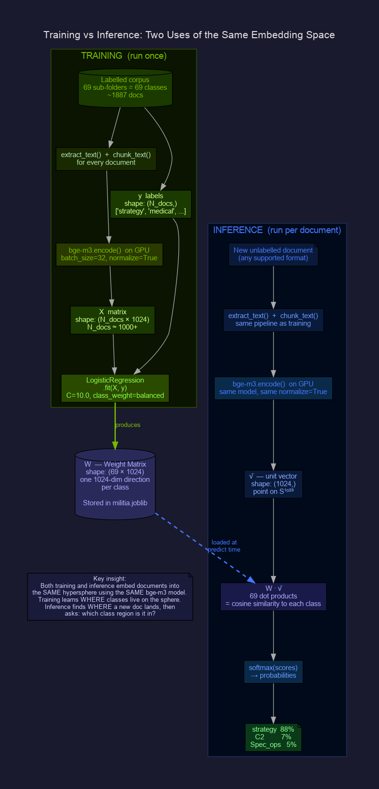

# The Hypersphere — How Semantic Embedding Classification Works

This document explains the geometric foundation of `doc_classifier_gpu.py`: why
documents are placed on a hypersphere, what that means, and how the classifier uses it.

---

## The core idea

When bge-m3 reads a document it produces a list of 1024 numbers — a *vector* — that
encodes the document's meaning. Before training or classification, every vector is
**L2-normalized**: divided by its own length so its length becomes exactly 1.

After normalization, every document vector lives on the surface of a
**unit hypersphere** — the 1024-dimensional generalization of a sphere. Two documents
about the same topic land near each other on that surface; two documents about unrelated
topics land far apart.

The classifier then draws boundaries on that surface to separate the 69 training classes.
A new document is placed on the sphere and whichever region it falls into determines its
predicted class.

---

## Why normalize? The unit circle analogy

Start with 2D to build intuition. Raw embedding vectors point in different directions
and have different lengths (magnitudes). Two documents about the same topic might produce
vectors pointing the same direction but with different lengths — a short summary and a
long manual both covering "tactics" should be treated as equally relevant to the tactics
class, not differently weighted by length.

L2-normalization throws away the magnitude and keeps only the direction. All vectors are
scaled so their tips land on the unit circle (radius = 1).



*Left: raw vectors of different lengths. Right: after normalization — all tips on the
unit circle. Direction is preserved; length is discarded.*

The key insight: **direction = meaning, magnitude = irrelevant**.

---

## Scaling to 1024 dimensions

In 2D the unit vectors live on a circle (S¹). In 3D they live on a sphere (S²). In 1024
dimensions they live on S¹⁰²³ — the unit hypersphere. You cannot visualise it, but the
geometry is identical: every point is at the same distance (1.0) from the origin, and
the meaningful quantity is the **angle** between any two points.

The 3D sphere is the closest visual proxy:



*Each colored cluster is a document class from the militia corpus. In reality the sphere
has 1024 dimensions, not 3 — but the structure is the same: similar documents cluster
together on the surface.*

---

## Cosine similarity — angle as semantic distance

The angle between two unit vectors is a direct measure of semantic similarity. This is
called *cosine similarity* because cos(θ) = **u** · **v** for unit vectors.



| cos θ | θ | Interpretation |
|-------|---|----------------|
| +1.0  | 0° | Identical meaning |
| +0.9  | ~26° | Very similar |
| 0.0   | 90° | Unrelated — orthogonal directions |
| −0.9  | ~154° | Opposite in meaning |
| −1.0  | 180° | Perfect semantic opposites |

For the classifier, **small angle = same class**, **large angle = different class**.

The formula for unit vectors:

```
cos(θ) = u · v = Σᵢ uᵢvᵢ
```

This is just a dot product — extremely fast to compute, even in 1024 dimensions.

---

## How the classifier draws boundaries

LogisticRegression learns one weight vector **wᵢ** per class. The decision score for
class *i* on a document **d** is:

```
score_i = wᵢ · d
```

This is the cosine similarity between the document and the class weight vector (both
unit-normalized during training). Softmax converts all 69 scores to probabilities.

Geometrically, each weight vector defines a **hyperplane through the origin** — a great
circle on the sphere's surface. Documents on one side score positive for class *i*;
documents on the other side score negative.



*The green great circle is the decision boundary between class A (green dots) and
class B (orange dots). The yellow arrow **w** is the normal to the boundary — the
LogisticRegression weight vector for class A.*

With 69 classes, there are 69 such hyperplanes. The sphere is divided into 69 regions.
A new document is embedded, normalized, placed on the sphere, and whichever region it
falls into gives the predicted class.

---

## The full pipeline

From raw file to class prediction:



1. **Extract text** — PyMuPDF for PDFs, EasyOCR for scanned/image files
2. **chunk_text()** — split into 4000-char chunks with 200-char overlap
3. **bge-m3 encode** — each chunk → 1024-dim float32 vector (batched on GPU)
4. **Mean-pool** — average all chunk vectors → one vector per document
5. **L2 normalize** — divide by magnitude → unit vector on S¹⁰²³
6. **LogisticRegression** — dot product against 69 weight vectors → scores
7. **Softmax** — scores → probabilities summing to 100%

---

## Why this beats TF-IDF

| Property | TF-IDF | bge-m3 embedding |
|----------|--------|------------------|
| Vocabulary | Must share exact words | Understands synonyms, paraphrases |
| Dimensionality | ~100k sparse dims | 1024 dense dims |
| Space structure | Bag-of-words (no geometry) | Unit hypersphere (smooth, meaningful) |
| Cross-language | ✗ Same word only | ✓ Multilingual (bge-m3) |
| Long documents | Noisy at high dim | Chunked + pooled — robust |
| Training size | Works with very few docs | Needs ~15+ docs/class for LR boundaries |

TF-IDF space is like a vast, mostly empty warehouse where documents are scattered. The
hypersphere is a dense, structured manifold where semantic neighborhoods are meaningful
and LR decision boundaries make sense even with limited training data.

---

## Inspecting what the model learned

After training, `clf.coef_` holds the weight matrix — shape `(69, 1024)`. Each row is
the direction in embedding space that most strongly predicts its class.

```python
import joblib, numpy as np

bundle  = joblib.load("militia.joblib")
clf     = bundle["clf"]
classes = clf.classes_

# Weight norm per class — higher = more distinctive in embedding space
norms = np.linalg.norm(clf.coef_, axis=1)
for cls, norm in sorted(zip(classes, norms), key=lambda x: -x[1])[:10]:
    print(f"  {cls:<35} {norm:.3f}")
```

A high weight norm means that class sits in a distinctive, easily-separable region of
the hypersphere. A low weight norm often indicates a small class or one that overlaps
semantically with other classes.

```python
# Cosine similarity between two class weight vectors
# (how similar are two classes in embedding space?)
from sklearn.metrics.pairwise import cosine_similarity

i = list(classes).index("strategy")
j = list(classes).index("tactics")
sim = cosine_similarity([clf.coef_[i]], [clf.coef_[j]])[0, 0]
print(f"strategy ↔ tactics similarity: {sim:.3f}")
# High value → classes are hard to separate; both cover related topics
```

---

## Key takeaways

1. Every document is a **point on a 1024-dimensional sphere**, not a bag of keywords
2. **Angle = semantic distance** — small angle means similar meaning, regardless of vocabulary
3. The classifier learns **great circle boundaries** on the sphere, one per class
4. **Confidence = cos(θ)** between the document and the class direction vector, softmax-normalized
5. The geometry is the same at 2D, 3D, and 1024D — only visualizability changes

---

## Graphviz architectural diagrams

These schematic diagrams complement the geometric visualizations above, explaining
the concepts as data-flow and structural graphs.

### dot1 — L2 normalization math



*Flow: raw bge-m3 output → magnitude computation → unit vector → placement on S¹⁰²³.
Shows what is discarded (magnitude) and what is preserved (direction).*

### dot2 — TF-IDF vs embedding space



*Side-by-side property comparison: ~100k sparse dims vs 1024 dense dims, vocabulary-
dependent vs semantic, flat metric space vs unit hypersphere.*

### dot3 — Full inference flow



*Complete path from raw file to class probabilities: extraction → chunking →
GPU encoding → mean-pool → normalize → 69 dot products → softmax → prediction.*

### dot4 — Semantic neighborhood map



*Classes from the militia corpus grouped by semantic family. Classes within a cluster
sit close together on the hypersphere. Dashed edges show cross-cluster relationships
(e.g. strategy ↔ Intel, C2 ↔ Computers & Data).*

### dot5 — Training vs inference



*Two parallel flows sharing the same embedding space. Training learns where classes
live on the sphere (produces weight matrix W). Inference finds where a new document
lands and asks which class region it falls in.*
